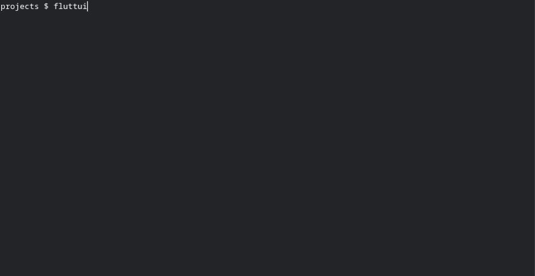

# fluttui

A terminal app that walks a user through the `flutter create` options.
Written in Go and built with [Bubble Tea](https://github.com/charmbracelet/bubbletea), [Bubbles](https://github.com/charmbracelet/bubbles), and [Lip Gloss](https://github.com/charmbracelet/lipgloss).

## Demo
